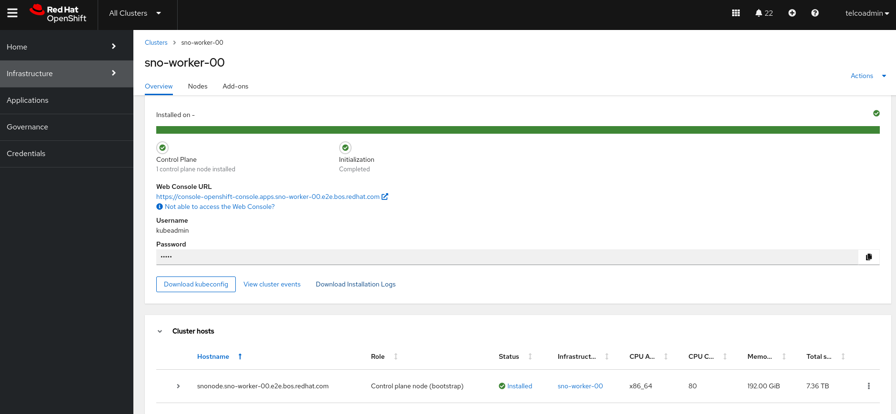

Alberto Losada Grande
# Boosting Red Hat GitOps ZTP at the network edge using factory-precaching-cli tool
## Summary
The factory-precaching-cli tool is a containerized Go binary that is publicly available in the Telco RAN tools container image. In this blog, we want to show how the factory-precaching-cli tool can drastically reduce the OpenShift installation time when using the Red Hat GitOps Zero Touch Provisioning (ZTP) workflow. This statement becomes very significant when dealing with low bandwidth networks either when connecting to a public or disconnected registry.

⚠️ The factory-precaching-cli tool is a Technology Preview feature only.

Looking at the results in the graph, where the x-axis represents network speed in Mbps, we realize how the installation time increases considerably in low bandwidth networks (under 100Mbps). Notice, that using the factory-precaching-cli tool improves the installation time in those environments. It is important to mention that not everything can be precached as today. So, when precaching, the network speed affects the installation time too, but in a minimal way compared with not using precache. 


In terms of bytes exchanged with the registry, we can see how we can save up to 85% percent of the total bytes transferred just by using the factory-precaching-cli tool. 


# Motivation
In environments with limited bandwidth and using the Red Hat GitOps ZTP solution to deploy a large number of SNO clusters, it might be desirable to avoid the use of the network for downloading the artifacts required for installing OCP. In cases where a high number of clusters are provisioned and the content is pulled from the same private registry, it can be advisable to minimize the traffic usage and avoid the registry being a bottleneck. 

Notice that the bandwidth to remote sites might be limited, resulting in long deployment times with the existing Red Hat GitOps ZTP solution. Therefore, improvement of the installation time might be a valid goal as well.

In order to address the bandwidth limitations, a factory pre-staging solution helps to eliminate the download of most of the artifacts at the remote site. As artifacts, we refer both to container images and optionally images such as the rootfs.

# Description
The factory-precaching-cli tool facilitates the pre-staging of servers before they are shipped to the site for later ZTP provisioning. The tool does the following:

* Creates a partition from the installation disk labeled as data.
* Formats the disk (XFS).
* Creates a GPT data partition at the end of the disk. Size is configurable by the tool.
* Copies the container images required by ZTP and to install OCP.
* Optionally, day-2 operators are copied to the partition too.
* Optionally, third-party container images can be copied to the partition too.
* Optionally, downloads locally the RHCOS rootfs image required by the minimal ISO to boot.

In this blog, we are going through the four stages of the process and we will discuss the results:

* Booting the RHCOS live
* Partitioning the installation disk
* Downloading the artifacts to the partition
* ZTP configuration for precaching

# Booting the RHCOS live image
Technically you can boot from any live ISO that provides container tools such as Podman. However, the supported and tested OS is Red Hat CoreOS. You can obtain the latest live ISO from [here](https://mirror.openshift.com/pub/openshift-v4/x86_64/dependencies/rhcos/latest/rhcos-live.x86_64.iso).

## Optional. Creating a custom RHCOS live ISO

Observe that the SSH server is not enabled in the RHCOS live OS by default. Therefore, booting from the mentioned live ISO is valid, but tedious since we need to connect to the server console to execute the commands. Also, it is not suitable for automating the precache process. In such cases, we can leverage [butane](https://coreos.github.io/butane/) and the [coreos-installer](https://coreos.github.io/coreos-installer/) utilities. They allow us to create a customized RHCOS live ISO with sshd enabled including some predefined credentials so it can be accessed right after booting. [Here](https://github.com/alosadagrande/openshift-telco/tree/main/butane) you have an example including an sshd configuration.

# Partitioning the installation disk
As a requirement before starting the partitioning process, we need the disk to be not partitioned. If it is partitioned we can boot from an RHCOS live ISO, delete the partition, and wipe the full device. Also, it is suggested to erase filesystem, RAID, or partition-table signatures from the device:

```sh
[root@liveiso]$ lsblk
NAME        MAJ:MIN RM   SIZE RO TYPE MOUNTPOINTS
sr0          11:0    1     1G  0 rom  /run/media/iso
nvme0n1     259:1    0   1.5T  0 disk 
├─nvme0n1p1 259:2    0     1M  0 part 
├─nvme0n1p2 259:3    0   127M  0 part 
├─nvme0n1p3 259:4    0   384M  0 part 
├─nvme0n1p4 259:5    0   1.2T  0 part 
└─nvme0n1p5 259:6    0   250G  0 part 

[root@liveiso]$ wipefs -a /dev/nvme0n1
/dev/nvme0n1: calling ioctl to re-read partition table: Success

[root@liveiso]$ lsblk
NAME    MAJ:MIN RM   SIZE RO TYPE MOUNTPOINTS
sda       8:0    0 893.3G  0 disk 
sr0      11:0    1     1G  0 rom  /run/media/iso
nvme0n1 259:1    0   1.5T  0 disk 
```

A second prerequisite is being able to pull the quay.io/openshift-kni/telco-ran-tools:latest container image that will be used to run the factory-precaching-cli tool. The image is publicly available in quay.io. If you are in a disconnected environment or have a corporate private registry, you will need to copy the image there. 

```sh
[root@liveiso]$ podman pull quay.io/openshift-kni/telco-ran-tools:latest 
Trying to pull quay.io/openshift-kni/telco-ran-tools:latest...
Getting image source signatures
… REDACTED …
Copying blob 146306f19891 done 
```

Finally, we need to be sure that the disk is big enough to precache all the container images required: OCP release images and optionally day2 operators. Based on our experience, 250GB is more than enough for OpenShift installation.

Let's start with the partitioning, for that we will use the partition argument from the factory-precaching-cli. We are going to create a single partition and a GPT partition table. This partition is going to be automatically labeled as “data” by default and created at the end of the device. Notice that the tool also formats the partition as XFS.

```sh
[root@liveiso]$ podman run --rm -v /dev:/dev --privileged quay.io/openshift-kni/telco-ran-tools:latest \
                 -- factory-precaching-cli partition -d /dev/nvme0n1 -s 250
Partition /dev/nvme0n1p1 is being formatted
```

Verify that a new partition is created:

```sh
[root@liveiso]$ lsblk
NAME        MAJ:MIN RM   SIZE RO TYPE MOUNTPOINTS
sr0          11:0    1     1G  0 rom  /run/media/iso
nvme0n1     259:1    0   1.5T  0 disk 
└─nvme0n1p1 259:2    0   250G  0 part 
```
❗ The coreos-installer requires the partition to be created at the end of the device and to be labeled as "data". Both requirements are necessary to save the partition when writing the RHCOS image to disk.

Once the partition is created, we can mount the device into /mnt and move to the next stage: downloading the OpenShift release bits:

```sh
[root@liveiso]$ mount /dev/nvme0n1p1 /mnt/
```

# Downloading the artifacts
This stage manages the download of the OCP release images. More advanced scenarios can be set up too, such as [downloading operators' images](https://docs.openshift.com/container-platform/4.13/scalability_and_performance/ztp_far_edge/ztp-precaching-tool.html#ztp-downloading-operator-images_pre-caching) or [downloading images from disconnected registries](https://docs.openshift.com/container-platform/4.13/scalability_and_performance/ztp_far_edge/ztp-precaching-tool.html#ztp-custom-pre-caching-in-disconnected-environment_pre-caching).

## Pre-requisites

* The partitioning stage must be previously executed successfully.
* Currently, the target or jump-host server needs to be connected to the Internet to obtain the dependency of OCP release images that need to be pulled down.
* A valid pull secret to the registries involved in the downloading process of the container images is required. Red Hat’s pull secret can be obtained from the Red Hat's console UI.

⚠️ If your systems are in a strictly disconnected environment you can execute the downloading process from a connected jumphost and then copy the artifacts and metadata information to the target server’s partition. 

Red Hat GitOps ZTP leverages [Red Hat Advanced Cluster Management for Kubernetes](https://docs.openshift.com/container-platform/4.13/scalability_and_performance/ztp_far_edge/ztp-deploying-far-edge-sites.html) to provision multiple managed clusters. The RHACM and MCE versions of the hub cluster will determine what assisted installer container images are used by the SNO to provision, report back the inventory information, and monitor the installation progress of the spoke cluster.  We want those images to be precached as well.

Check the version of RHACM and MCE by executing these commands in the hub cluster:
```sh
[user@hub]$ oc get csv -A -o=custom-columns=NAME:.metadata.name,VERSION:.spec.version \
            | grep -iE "advanced-cluster-management|multicluster-engine"

multicluster-engine.v2.3.1                    2.3.1
advanced-cluster-management.v2.8.1            2.8.1
```

Next, let’s copy a valid pull secret to access our container registry. Notice that this is done on the server that is going to be installed. If we are using a disconnected registry to pull down the images, the proper certificate is required too:

```sh
[root@liveiso]$ mkdir /root/.docker 
[root@liveiso]$ cp config.json /root/.docker/config.json 

[root@liveiso]$ cp /tmp/rootCA.pem /etc/pki/ca-trust/source/anchors/.
[root@liveiso]$ update-ca-trust
```
⚠️ If the images are being downloaded from the Red Hat registry then you only need to copy the Red Hat’s pull secret. No extra certificates are required.

In recent versions, the factory-precaching-cli tool provides a feature for filtering images from the download that are not needed for a given configuration. Below is an example of excluding images for a bare metal server installation:

```yaml
---
patterns:
  - alibaba
  - aws
  - azure
  - cluster-samples-operator
  - gcp
  - ibm
  - kubevirt
  - libvirt
  - manila
  - nfs
  - nutanix
  - openstack
  - ovirt
  - sdn
  - tests
  - thanos
  - vsphere
```

In order to speed up the pulling process the factory-precaching-cli tool will use parallel workers to download multiple images simultaneously. Now, we are ready to download the required artifacts locally to our /mnt partition. 

As we can see in the execution below, several host paths are mounted into the container:

* **/mnt** folder where the artifacts are going to be stored.
* **$HOME/.docker** folder where the registry pull secret is located.
* **/etc/pki** folder where the private registry certificate is stored.
  
Then, we add the download parameter and the OCP release version we want to precache. Also, the RHACM and MCE versions of the hub cluster we obtained. Observe that some extra images can also be precached using the --img flag and the --filter option is included avoiding container images not needed.

```sh
[root@snonode ~]$ podman run -v /mnt:/mnt -v /root/.docker:/root/.docker -v /etc/pki:/etc/pki \
--privileged --rm quay.io/openshift-kni/telco-ran-tools:latest -- factory-precaching-cli \
download -r 4.13.11 --acm-version 2.8.1 --mce-version 2.3.1 -f /mnt  \
--img quay.io/alosadag/troubleshoot --filter /mnt/image-filters.txt 

… REDACTED …
gent-rhel8@sha256_d670e52864979bd31ff44e49d790aa4ee26b83feafb6081c47bb25373ea91f65
Downloaded artifact [165/165]: agent-service-rhel8@sha256_f2929eb704ae9808ea46baf3b3511a9e4c097dfca884046e5b61153875159469

Summary:

Release:                            4.13.11
ACM Version:                        2.8.1
MCE Version:                        2.3.1
Include DU Profile:                 No
Workers:                            64

Total Images:                       165
Downloaded:                         165
Skipped (Previously Downloaded):    0
Download Failures:                  0
Time for Download:                  2m32s
```
After a couple of minutes, depending on the network speed, a complete summary of the process will be displayed. Finally, it is suggested to unmount the partition before starting the installation process.

```sh
[root@liveiso]$ sudo umount /mnt/
```

❗ TIP: If multiple servers are going to be installed with the same configuration, you can speed up the process by uploading artifacts and metadata to an HTTP server reachable from the servers that are going to be installed. Then, download the content from there locally.

# ZTP precaching configuration

This is the last stage where we get ready to provision one or multiple SNOs using the precached artifacts local to each cluster. Basically, we need to let Zero Touch Provisioning know that before starting the proper step of the installation process there are container images that do not have to be pulled from a registry.

Red Hat GitOps ZTP allows you to provision OpenShift SNO, compact, or standard clusters with declarative configurations of bare-metal equipment at remote sites following a GitOps deployment set of practices. ZTP is a project to deploy and deliver OpenShift 4 in a hub-and-spoke architecture (in a relation of 1-N), where a single hub cluster manages many managed or spoke clusters. The central or hub cluster will manage, deploy, and control the lifecycle of the spokes using Red Hat Advanced Cluster Management (RHACM). 

## Red Hat GitOps ZTP Workflow

Red Hat GitOps Zero Touch Provisioning (ZTP) leverages multiple components to deploy OCP clusters using a GitOps approach. The workflow starts when the node is connected to the network and ends with the workload deployed and running on the nodes. It can be logically divided into two different stages: provisioning of the SNO and applying the desired configuration.
The provisioning configuration is defined in a siteConfig custom resource that contains all the necessary information to deploy your cluster or clusters. The provisioning process includes installing the host operating system (RHCOS) on a blank server and deploying the OpenShift Container Platform. This stage is managed mainly by a ZTP component called Assisted Installer which is part of the [Multicluster Engine](https://docs.openshift.com/container-platform/4.13/architecture/mce-overview-ocp.html) (MCE).


Once the clusters are provisioned, day-2 configuration can be optionally defined in multiple policies included in PolicyGenTemplates (PGTs) custom resources. That configuration will be automatically applied to the specific managed clusters.

# Preparing the siteConfig
As mentioned, a siteConfig manifest defines in a declarative manner how an OpenShift cluster is going to be installed and configured. Here is an [example single-node OpenShift SiteConfig CR](https://docs.openshift.com/container-platform/4.13/scalability_and_performance/ztp_far_edge/ztp-precaching-tool.html#ztp-pre-caching-config-con_pre-caching). However, unlike the regular ZTP provisioning workflow, three extra fields need to be included:

* **clusters.ignitionConfigOverride**. This field adds an extra configuration in ignition format during the ZTP discovery stage. Detailed information [here](https://docs.openshift.com/container-platform/4.13/scalability_and_performance/ztp_far_edge/ztp-precaching-tool.html#ztp-pre-caching-config-clusters-ignitionconfigoverride_pre-caching).
* **nodes.installerArgs**. This field allows us to configure the way coreos-installer utility writes the RHCOS live ISO to disk. It helps to avoid overriding the precache partition labeled as ‘data’. More information can be found [here](https://docs.openshift.com/container-platform/4.13/scalability_and_performance/ztp_far_edge/ztp-precaching-tool.html#ztp-pre-caching-config-nodes-installerargs_pre-caching).
* **nodes.ignitionConfigOverride**. This field adds similar functionality as the clusters.ignitionConfigOverride, but in the OCP installation stage. This field allows the addition of persistent extra configuration to the node. More information [here](https://docs.openshift.com/container-platform/4.13/scalability_and_performance/ztp_far_edge/ztp-precaching-tool.html#ztp-pre-caching-config-nodes-ignitionconfigoverride_pre-caching)

In recent versions of the factory-precaching-cli tool, things are much easier. The user can provide a valid siteConfig custom resource and the siteconfig sub-command will help to ensure the right extra fields and any updates to prestaging hooks (bug fixes, etc) are reflected in the siteConfig. 

The command writes the updated siteConfig to stdout, which can be redirected to a new file for comparison with the original prior to adoption.
```sh
[root@liveiso]$ Update site-config, using default partition label
podman run --rm -i quay.io/openshift-kni/telco-ran-tools:latest -- factory-precaching-cli siteconfig \
    <site-config.yaml >new-site-config.yaml
```

## Start ZTP

Once the resulting siteConfig is uploaded to the Git repo that OpenShift GitOps is monitoring, we are ready to push the sync button to start the whole process. Remember that the process should require Zero Touch.

⚠️ OpenShift GitOps is configured by default on auto-sync so we do not even have to click on any button. That’s Zero Touch.

The OpenShift GitOps operator running in the hub cluster will sync the configuration from the remote Git repository and apply it. That will be seen as green circles on every resource:


We can also verify that the resource has been applied using the oc command-line on the hub:

```sh
[user@hub]$ oc get bmh,clusterdeployment,agentclusterinstall,infraenv -A

NAMESPACE               NAME                                                               STATE                    CONSUMER               ONLINE   ERROR   AGE
 baremetalhost.metal3.io/snonode.sno-worker-00.e2e.bos.redhat.com   registering                                     true             50s

NAMESPACE       NAME                                                INFRAID   PLATFORM          REGION   VERSION   CLUSTERTYPE   PROVISIONSTATUS   POWERSTATE   AGE
sno-worker-00   clusterdeployment.hive.openshift.io/sno-worker-00             agent-baremetal                                    Initialized                    52s

NAMESPACE       NAME                                                             CLUSTER         STATE
sno-worker-00   agentclusterinstall.extensions.hive.openshift.io/sno-worker-00   sno-worker-00   insufficient

NAMESPACE       NAME                                                ISO CREATED AT
sno-worker-00   infraenv.agent-install.openshift.io/sno-worker-00   2023-09-29T09:05:24Z
```

⚠️ Notice that the siteConfig custom resource has been divided into multiple different resources that can be understood by the MCE operator.

# Monitoring the process

Monitoring the provisioning is basically [monitoring the ZTP workflow](https://docs.openshift.com/container-platform/4.13/scalability_and_performance/ztp_far_edge/ztp-manual-install.html#ztp-checking-the-managed-cluster-status_ztp-manual-install) adding a couple of verifications that it is worth mentioning. First, in a couple of minutes after syncing the configuration we will notice that the server is being rebooted and it’s booting from the virtual CD.


During the boot process, a systemd unit is executed before finishing the boot process. That unit will extract a few precached container images that are needed during the discovery stage of the ZTP process. They can be monitored from the console. The information is also logged into the journal log:

```sh
$ journalctl
…
Sep 29 09:10:52 snonode bash[2452]: extract-ai.sh: [DEBUG] Processing image quay.io/openshift-release-dev/ocp-v4.0-art-dev@sha256:4d2959b34b95a21265c39be7fe3cd3029f98b6e65de8fd3b8a473af0bd2>
Sep 29 09:10:52 snonode bash[2884]: extract-ai.sh: [DEBUG] Extracting image quay.io/openshift-release-dev/ocp-v4.0-art-dev@sha256:3aeff89d5126708be7616aea34cb88470145a71c82b81646e64b8919d4b>
… REDACTED …
Sep 29 09:11:26 snonode systemd[1]: precache-images.service: Deactivated successfully.
Sep 29 09:11:26 snonode systemd[1]: Finished Load prestaged images in discovery stage.
Sep 29 09:11:26 snonode systemd[1]: precache-images.service: Consumed 3min 38.548s CPU time.
```

The discovery stage finishes right after the RHCOS live ISO is written to the disk. The next restart will boot from the hard drive and we start what we call the OCP installation stage. In this phase, the precached OCP release images are extracted and are ready to be used during the provisioning. See the systemd service loading the precache image in the image below:


Finally, the cluster is installed. From the multicloud console running on the hub cluster, we can download the kubeconfig and kubeadmin credentials. Now, the cluster is ready.




